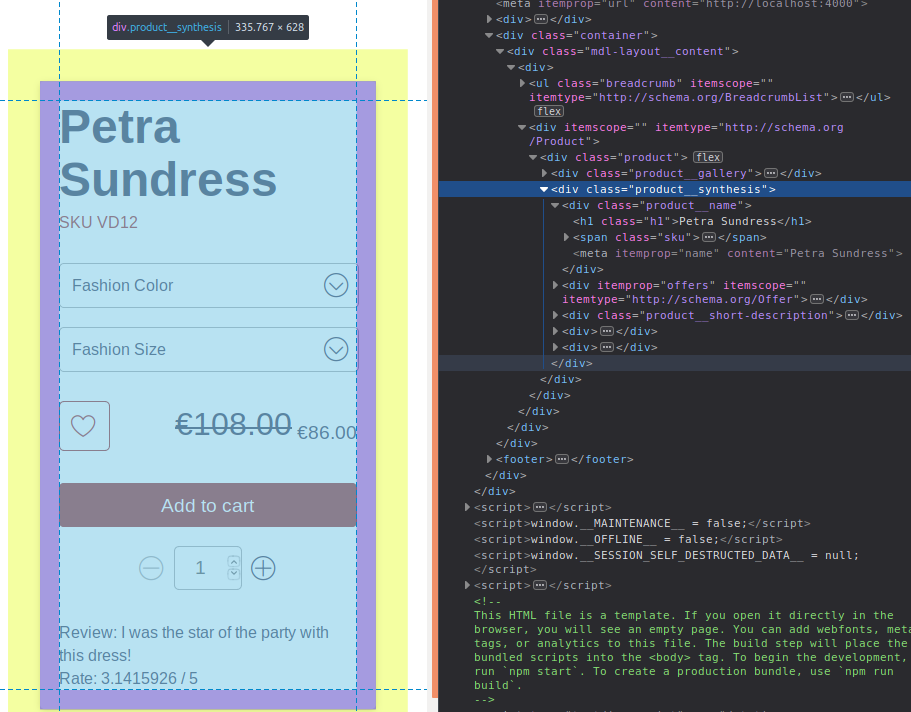

Let's say we want to add a new element to display on a product's page (for instance, a product's rate). You will have to:

1. Add the attribute's actual value to your database.
2. Create a new module.
3. Define the schema, implement the resolver and display it on screen.

## Add a value to your database

The process to do so may vary with the backend software you are using. For Magento 2 (used in this example), you can refer to [this](https://www.fastcomet.com/tutorials/magento2/product-attributes).

## Create a new GraphQL module

We want to display the `rate` of a product on the product page. To keep it simple, it will only consist in displaying a number, the value can be manually edited by the merchant. This feature will be stored in a new module called `mymodule` ; you could directly edit the files at `node_modules/front-commerce/path/to/something`, but this is not recommended since running `npm install` might erase any modification.
Learn more about Front-Commerce's folder structure [here](/docs/essentials/extend-the-theme.html).

```bash
mkdir mymodule
cd mymodule
```

In this example, the files we are going to override are located at `node_modules/front-commerce/src/web/theme/modules/ProductView/Synthesis/`, so will create in our `mymodule` folder the following directories. More details [here](/docs/essentials/extend-the-graphql-schema.html).

```bash
mkdir -p server/modules/acme
```

(Note that the `acme` name has been chosen arbitrarily.)

## Add the module to Front-Commerce

Now we will add the module we just made to Front-Commerce. Edit the `.front-commerce.js` file (root folder) as shown below to do so.

```diff
module.exports = {
  name: "Front Commerce Skeleton",
  url: "http://localhost:4000",
- modules: ["./src"],
+ modules: ["./mymodule", "./src"],
  serverModules: [
    { name: "FrontCommerce", path: "server/modules/front-commerce" },
-   { name: "Magento2", path: "server/modules/magento2" }
+   { name: "Magento2", path: "server/modules/magento2" },
+   { name: "Acme", path: "./mymodule/server/modules/acme" }
  ]
};
```

### Expand the Product definition

Create a file named `schema.gql` and type in the following code. It means that we are expanding the definition of a product: it can now be rated.

```js
// mymodule/server/modules/acme/schema.gql
extend type Product {
  rate: Float
}
```

### Implement the resolver

We must now define what Front-Commerce should fetch when `rate` is requested in a GraphQL query; in other words we must write the code that will **resolve** the queries for the rates.

Create a file named `resolvers.js` and type in the following code. It implements the resolver.

```js
// mymodule/server/modules/acme/resolvers.js
export default {
  Product: {
    rate: parent => {
      return parseFloat(parent.rate);
    }
  }
};
```

### Declare the module

If we want our code to be taken into account when the module is loaded, we must reference it.

In the file named `index.js`, type in the following code. It references the schema and the resolver from earlier.

```js
// mymodule/server/modules/acme/index.js
import typeDefs from "./schema.gql";
import resolvers from "./resolvers";

export default {
  namespace: "Acme",
  typeDefs: typeDefs,
  resolvers: resolvers
};
```

## Discover the playground

By typing `yourhostname/playground` or `yourhostname/graphiql` (in our case `localhost:4000/playground`) in your browser address bar, you can access a GraphQL playground with a nice GUI to test your queries. For instance, type the following code in the left pane and press `Ctrl` + `Enter` (or click the arrow button)

```graphql
{
  product(sku: "yourSKUhere") {
    name
    rate
  }
}
```

From this GraphQL query, you should get a JSON content that looks like this:

```json
{
  "data": {
    "product": {
      "name": "Your product name",
      "rate": // the value stored in your backoffice (Magento 2 in this case)
    }
  }
}
```

### Overriding the files

In **this** example, the files to be overridden are `ProductSynthesisFragment.gql` and `Synthesis.js` both located at `node_modules/front-commerce/src/web/theme/modules/ProductView/Synthesis/`. Copy and paste them into `mymodule/web/theme/modules/ProductView/Synthesis`.

#### How to find which files to edit

On your web page, right click on the element you wish to modify, then click on **Inspect Element**. In the inspector, you can look for the `className` that holds the elements you want to edit. Then you can search for that keyword in your `node_modules/front-commerce/src` folder and you will find the right files.

We've included images to illustrate our example.



### Updating the query

In `ProductSynthesisFragment.gql`, add the following query line. It means that the application will request the `rate` field as well when sending the query. (Depending on the version of Front-Commerce you are using, the content might differ slightly.)

```diff
#import "theme/components/organisms/Configurator/ProductConfiguratorFragment.gql"
#import "theme/modules/AddToCart/ProductStockFragment.gql"
#import "theme/components/atoms/Typography/Price/ProductPriceFragment.gql"
#import "theme/modules/ProductView/Details/ProductDetailsFragment.gql"

fragment ProductSynthesisFragment on Product {
  sku
  name
  ...ProductPriceFragment
  description
+ rate
  ...ProductConfiguratorFragment
  ...ProductStockFragment
  ...ProductDetailsFragment
  configurations {
    product {
      sku
      ...ProductPriceFragment
    }
  }
}
```

### Displaying the result on screen

We're almost there! In the file `Synthesis.js` (which generates the product page), you can add some code to display the `rate`. Knowing React.js or at least HTML syntax is necessary to perform this step without impacting other items on the page.

```diff
// Many more things here
const ProductSynthesis = props => {
  const {
    product
    // Many more things here
  } = props;
  return (
    <div className="product__synthesis">
      {/* Many more things here */}
+     <div>Rate: {product.rate} / 5</div>
      {/* Many more things here */}
    </div>
  );
};

export default ProductSynthesis;
```
