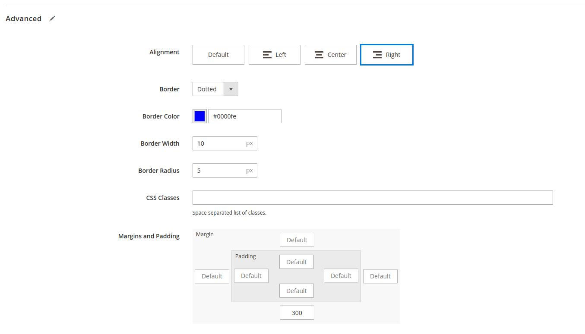

<blockquote class="feature--new">
_Since version 2.11.0 (early preview)_
</blockquote>

Common tasks as a developer would consist in creating new _content types_ and refining UI components so that merchants can create the rich shopping experiences that were designed for _their_ customers.

## Prerequisites

[Page Builder](https://magento.com/products/magento-commerce/page-builder) is only available for content that:

- are displayed using [the `<WysiwygV2>` component and its related `WysiwygFragment` GraphQL fragment](/docs/advanced/theme/wysiwyg.html#lt-WysiwygV2-gt-usage)
- get data from GraphQL fields resolved using [the `MagentoWysiwyg` type](/docs/advanced/theme/wysiwyg-platform.html#MagentoWysiwyg) **(which is the case of all default Magento rich content fields)**

Please check these prerequisites first if your content does not appear properly.

## Concepts

Page Builder content types have 2 integration points:

- **server side data conversion** will parse Magento HTML response to extract rich structured data exposed in GraphQL
- **client side React components** will display the content using existing components, from data fetched from GraphQL

## Supported content types

We currently support these content types in a basic way.

<blockquote class="info">
Additional data is exposed via the GraphQL for more more advanced [Customized UI components](#Customize-UI-components) implementations.
</blockquote>

### Layout

[Magento Page Builder Layout](https://docs.magento.com/user-guide/cms/page-builder-layout.html)

| Type         | Name      | Description                                 |
| ------------ | --------- | ------------------------------------------- |
| Row          | `row`     | Adds a row container to the stage.          |
| ColumnGroups | `heading` | Adds a column group container to the stage. |
| Column       | `column`  | Adds a column to the stage.                 |

<blockquote class="wip">
 **Work In Progress:** We only have partial support for the `row` content type. <br />
 Here are the unsupported props:
  <ul style="list-style:none;margin-bottom:0;opacity:0.75;">
    <li>✖ Mobile Image</li>
    <li>✖ Fluid Width <i>- requires a supported layout</i></li>
    <li>✖ Full Bleed <i>- requires a supported layout</i></li>
    <li>✖ Video Background <i>- data exposed with `video`</i></li>
    <li style="margin-bottom:0;">✖ Parallax Background <i>- data exposed with `parallax`</i></li>
  </ul>
</blockquote>

### Elements

[Magento Page Builder Elements](https://docs.magento.com/user-guide/cms/page-builder-elements.html)

| Type       | Name          | Description                                      |
| ---------- | ------------- | ------------------------------------------------ |
| Text       | `text`        | Adds a text container and editor to the stage.   |
| Heading    | `heading`     | Adds a heading container to the stage.           |
| Buttons    | `buttons`     | Adds a set of buttons to the stage.              |
| ButtonItem | `button-item` | Adds a individual button container to the stage. |
| Divider    | `divider`     | Adds a divider container to the stage.           |
| HTML Code  | `html`        | Adds a HTML code container to the stage.         |

### Media

[Magento Page Builder Media](https://docs.magento.com/user-guide/cms/page-builder-media.html)

| Type   | Name     | Description                               |
| ------ | -------- | ----------------------------------------- |
| Image  | `image`  | Adds a image container to the stage.      |
| Slider | `slider` | Adds a slider to the stage.               |
| Slide  | `slide`  | Adds a slide for the slider to the stage. |
| Map    | `map`    | Adds map with locations to the stage.     |

<blockquote class="wip">
 **Work In Progress:** Support for internal `product`, `page` and `category` links for `button-item` and `image`
</blockquote>

### Upcoming

- Internal links.
- Native Magento widgets.

Let us know if you have specific needs.

## Styles

Front-Commerce supports custom styles from the _Advanced_ Magento settings of all content types:



## Extend the Page Builder

You can extend existing Page Builder content types, or register new ones specific to your projects. To do so, there are 2 extension points: UI and GraphQL data resolution.

### Customize UI components

<blockquote class="wip">
**Work In Progress:** if you need details right now, please <span class="intercom-launcher">[contact us](mailto:support@front-commerce.com)</span>. We will make sure to answer you in a timely manner.
</blockquote>

- override `theme/modules/WysiwygV2/MagentoWysiwyg/PageBuilder/_appComponents.scss` to register your custom styles
- override `theme/modules/WysiwygV2/MagentoWysiwyg/PageBuilder/appComponentsMap.js` to register new components (or override [existing ones](https://gitlab.com/front-commerce/front-commerce/blob/main/src/web/theme/modules/WysiwygV2/MagentoWysiwyg/PageBuilder/index.js))

<!-- Override GraphQL fragment too (not yet externalized in a specific fragment FC code) -->

### Expose content types data in GraphQL

<blockquote class="wip">
**Documentation In Progress:** if you need details right now, please <span class="intercom-launcher">[contact us](mailto:support@front-commerce.com)</span>. We will make sure to answer you in a timely manner.
</blockquote>

The `PageBuilder` loader allows you to register new content types.

First, you must define your content type. Content types must extend the `ContentType` class (see below). The `name` should match Magento's content type identifier and the `extractData` method can be used to return structured data to be exposed as GraphQL fields for this type.

```javascript
import ContentType from "server/modules/magento2/wysiwyg/loaders/content-types/ContentType";

export default class Foo extends ContentType {
  name = "foo";
  extractData(node) {
    return {
      // custom data. Can also be extracted from the passed `node` information
      bar: "baz",
    };
  }
}
```

Then you must register it from a `contextEnhancer`, using the `PageBuilder.registerContentType` method:

```javascript
PageBuilder.registerContentType(
  new Foo(), // <-- the content type defined above
  "MyPageBuilderFooData" // <-- the GraphQL type for related data default to MagentoPageBuilderDefaultData (if no additional data)
);
```

If your content type exposes additional data with a specific GraphQL type (`MyPageBuilderFooData` in this current example), you will then have to update your resolvers. To do so, Front-Commerce provides a generic `PageBuilderContentTypeResolver` class that will expose data returned by the content type's `extractData`.

```graphql
# schema.gql
# Your custom page builder node data must implement
# both MagentoPageBuilderNodeData and WysiwygNodeData GraphQL interfaces
type MyPageBuilderFooData implements MagentoPageBuilderNodeData & WysiwygNodeData {
  dataId: ID
  appearance: String
  bar: String # <- custom structured data
}
```

```javascript
// resolvers.js
import PageBuilderContentTypeResolver from "server/modules/magento2/wysiwyg/graphql/PageBuilderContentTypeResolver";

export default {
  MyPageBuilderFooData: new PageBuilderContentTypeResolver(),
};
```

<!-- TODO: document advanced usage of custom resolver -->
